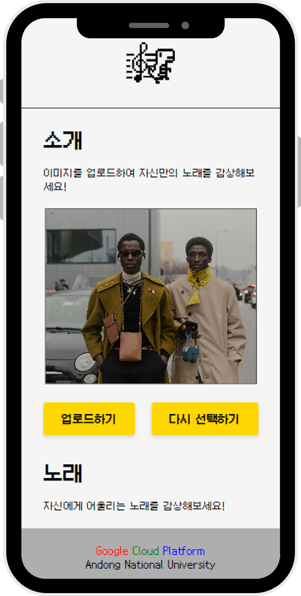
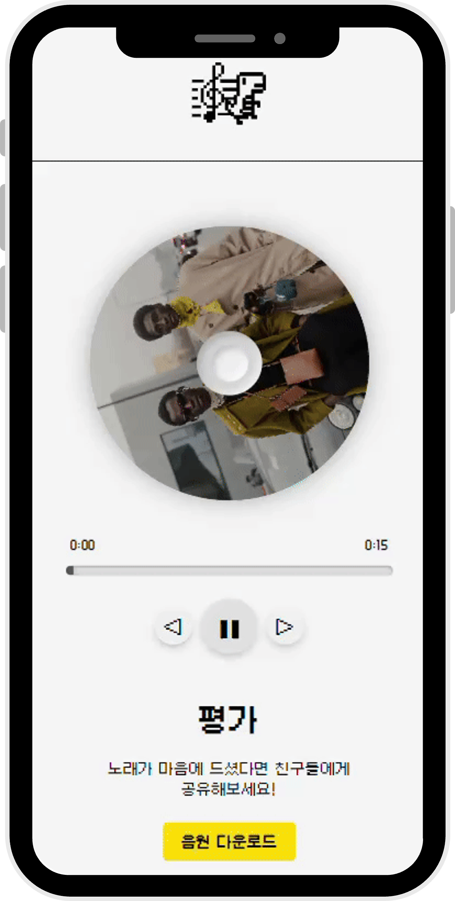

# Melodify: AI 기반 음악 생성 웹 애플리케이션

## 프로젝트 요약
Melodify는 사용자가 이미지를 업로드하면 해당 이미지의 분위기와 내용을 기반으로 캡셔닝을 생성하고, 이를 활용하여 맞춤형 음악을 생성하는 AI 기반 웹 애플리케이션입니다. 이 프로젝트는 Django 백엔드와 Google Cloud Platform(GCP)의 Vertex AI를 활용하여 다수의 사용자가 동시에 접근할 수 있는 안정적이고 확장 가능한 서비스를 제공합니다.

---

## 프로젝트 배경
기존의 이미지 생성 서비스는 비주얼 중심의 콘텐츠 제공에 초점이 맞춰져 있었습니다. Melodify는 이미지의 감성과 분위기를 음악으로 표현하여 새로운 방식의 창작 경험을 제공합니다. 이 프로젝트는 창작자, 디자이너, 음악 애호가들이 영감을 얻고 창작 활동을 확장할 수 있도록 돕기 위해 설계되었습니다.

---

## 프로젝트 주요 화면

### 팀 멤버

  

### 구현 화면
| 업로드 페이지                                                                 | 결과 페이지                                                                 |
|------------------------------------------------------------------------------|------------------------------------------------------------------------------|
|  |  |
| 사용자가 이미지를 업로드하고, 해당 이미지의 음악 생성 작업을 시작할 수 있는 페이지입니다. | 생성된 음악을 실시간으로 재생하고 다운로드할 수 있는 기능을 제공합니다. |

---
    
## 주요 기능

1. **이미지 업로드 및 저장**
   - 사용자로부터 이미지를 업로드받아 Google Cloud Storage(GCS)에 안전하게 저장합니다.
   - 이미지 처리 속도와 안정성을 위해 비동기 작업 구조를 채택했습니다.

2. **이미지 캡셔닝 생성**
   - OpenAI API를 사용하여 업로드된 이미지의 분위기와 내용을 분석하고, 이를 기반으로 적절한 캡션을 생성합니다.
   - 생성된 캡션은 음악 생성 파이프라인의 입력 데이터로 활용됩니다.

3. **음악 생성**
   - GCP Vertex AI의 머신러닝 모델을 활용하여 자동으로 음악을 생성합니다.
   - 생성 과정은 GCP의 파이프라인을 통해 효율적으로 관리됩니다.

4. **결과 페이지 제공**
   - 생성된 음악을 웹 인터페이스에서 실시간으로 재생하고, 다운로드할 수 있는 옵션을 제공합니다.
   - 사용자 경험을 고려한 직관적인 UI를 설계했습니다.

---

## 🛠 사용 기술 및 라이브러리

- **프론트엔드**: HTML, CSS
- **백엔드**: Django, Django REST Framework
- **AI 및 머신러닝**:
  - OpenAI API: 이미지 캡셔닝 생성
  - GCP Vertex AI: 음악 생성 파이프라인
- **클라우드 및 배포**:
  - Google Cloud Storage: 이미지 및 음악 파일 저장
  - GCP CICD: 자동화된 모델 배포

---

## 🖥 담당한 기능 (BE, FE, Cloud)

- 이미지 업로드 및 저장 기능.
    - 사용자로부터 업로드된 이미지를 Django 웹 애플리케이션에서 수신하고, 이 이미지 데이터를 처리하여 **Google Cloud Storage(GCS)에 저장**.
    - 이미지 업로드 처리에서는 Django의 `FileField`와 `request.FILES`를 사용하여 사용자가 업로드한 파일을 수신하고, Google Cloud Python 라이브러리를 통해 지정된 버킷에 파일을 저장하는 로직을 구현
- 캡셔닝 생성 및 전달
    - 이미지를 업로드할 때, **OpenAI GPT 모델을 통해 이미지 캡셔닝(설명) 텍스트를 생성**하여 콘텐츠에 의미를 부여.
    - 이미지 캡셔닝 API 호출 시, 이미지를 Base64로 인코딩한 뒤 OpenAI API에 전송해 설명을 생성하고, 이 설명을 추후 음악 생성 파이프라인의 입력 프롬프트로 사용.

- Google Cloud Pipeline을 통한 음악 생성 프로세스.
    - 이미지 설명을 **Vertex AI의 파이프라인 입력 프롬프트로 전달하여 생성된 음악을 받아오는 과정**을 관리.
    - 이 파이프라인은 자동화된 워크플로우로, 설명을 텍스트 프롬프트로 사용하여 GCP 상의 음악 생성 모델을 통해 음원을 생성하도록 구현.
    
- 결과 반환 및 세션 관리
    - 파이프라인 작업이 완료되면 Google Cloud Storage에서 생성된 음악 파일을 로드하여 사용자에게 반환하고, **세션 관리**를 통해 작업 결과를 유지 및 초기화하도록 구현.
    - 세션에서 이미지, 캡션 텍스트, 생성된 음악 파일 URL을 저장하여, 결과 페이지에서 사용자에게 업로드된 이미지와 함께 음악을 재생할 수 있도록 했습니다.

---

## 💡 성장한 부분

- **클라우드 인프라와 배포 자동화에 대한 이해**
    - Google Cloud Platform(GCP)을 활용해 **클라우드 환경에서의 인프라 구성과 데이터 관리 방식**에 대해 깊이 이해하게 되었습니다. 특히, **Vertex AI**를 통해 AI 모델 파이프라인을 효율적으로 구성하고, CI/CD 설정을 통해 자동화된 배포 환경을 구축함으로써 클라우드 인프라와 배포 자동화의 중요성을 실무적으로 체득했습니다.
- **AI 모델과 백엔드 시스템의 통합 경험**
    - AI 모델을 백엔드 시스템에 통합하고, **사용자 요청에 따라 동적으로 예측 서비스를 제공하는 과정**을 직접 구현했습니다. 특히, OpenAI의 GPT 모델과 Google Cloud Storage를 연동하여 **이미지 업로드부터 음악 생성까지의 전체 파이프라인을 구축**함으로써 AI 모델을 서비스로 전환하는 실무 역량을 크게 강화할 수 있었습니다.
- **대규모 사용자를 고려한 데이터 처리 및 세션 관리 능력 강화**
    - 이번 프로젝트는 다수의 사용자가 동시에 사용할 수 있도록 설계되어야 했기 때문에, **동시성을 고려한 데이터 저장과 세션 관리**에 집중할 수 있었습니다. 이를 통해 서버 자원을 효율적으로 활용하면서도 개별 사용자의 데이터를 안전하게 관리하는 방안을 습득했고, 이러한 경험을 통해 웹 애플리케이션의 확장성과 안정성을 고려하는 능력을 크게 성장시켰습니다.
- **실시간 피드백과 결과 반환의 구현**
    - 사용자 경험을 최적화하기 위해 **실시간 API 통신과 결과 반환에 필요한 로직을 개선**하면서 사용자 친화적인 백엔드 로직을 작성할 수 있었습니다. 음악 생성과 같은 비동기 작업의 완료 상태를 확인하고 결과를 반환하는 기능을 개발하면서, 실시간으로 처리되는 API의 특성을 이해하고 최적화하는 방법을 배웠습니다.
- **문제 해결 및 예외 처리 능력 향상**
    - 이미지 파일을 다루고, 클라우드에 파일을 저장하고, AI 모델과 상호작용하는 작업들은 다양한 예외 상황이 발생할 가능성이 높았습니다. 프로젝트 전반에 걸쳐 발생하는 예외와 오류를 적절히 처리하고, 안정적인 사용자 경험을 제공하기 위한 예외 처리 로직을 개선하면서, **문제 해결 능력과 예외 처리에 대한 깊은 이해**를 얻게 되었습니다.
 
---

## 참고 자료
- [발표 자료 PDF 보기](./1조_Melodify.pptx.pdf)

---

### 문의
궁금한 사항은 이메일로 연락해주세요: [jhs789654123@gmail.com]
